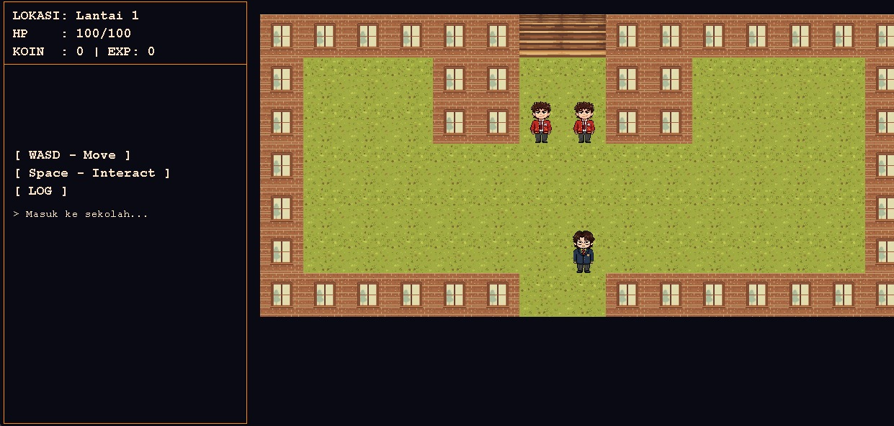

# STM Pembalasan (GamePBO)

Tugas Akhir Pemrograman Berorientasi Objek (PBO). Proyek ini adalah *game desktop* 2D RPG yang dikembangkan menggunakan bahasa Java.

## Deskripsi Singkat
Pemain mengendalikan karakter "Siswa Pindahan" untuk menjelajahi area sekolah dan mengalahkan gerombolan perundung. *Source code* proyek ini disusun dengan mengimplementasikan prinsip utama OOP Java, yang mencakup *Encapsulation*, *Inheritance*, *Polymorphism*, *Abstract Class*, dan *Interface*.

## Fitur Sistem
* Navigasi *grid* dengan deteksi *collision* pada batas tembok.
* Interaksi area, seperti Kantin untuk memulihkan HP dan Ruang Guru untuk melakukan *level up*.
* Sistem *combat* berbatas waktu dengan mekanik respons (Pukulan, Tendangan, Tangkisan) dan kalkulasi *clash multiplier*.
* *Rendering* aset grafis 2D, *Background Music* (BGM), dan *Sound Effects* (SFX).

## Kontrol
* W, A, S, D: Bergerak ke empat arah atau memilih opsi *combat*.
* Spasi: Melakukan interaksi (pindah lantai, memajukan dialog, atau konfirmasi aksi).
* R: Melakukan *restart* permainan.
* M: Kembali ke halaman menu utama.

## Instalasi dan Eksekusi
1. Pastikan komputer Anda telah terinstal Java Development Kit (JDK).
2. Lakukan *clone repository* ini atau unduh sebagai *file zip*.
3. Buka direktori proyek menggunakan IDE Java pilihan Anda.
4. Eksekusi *file* `Main.java` yang berada di dalam direktori `src/main/`.

## Dokumen Terkait
* Laporan Akhir: TBA
* Slide Presentasi Teori: TBA
* Slide Presentasi Praktikum: TBA
* Sumber BGM: OpenGameArt.org